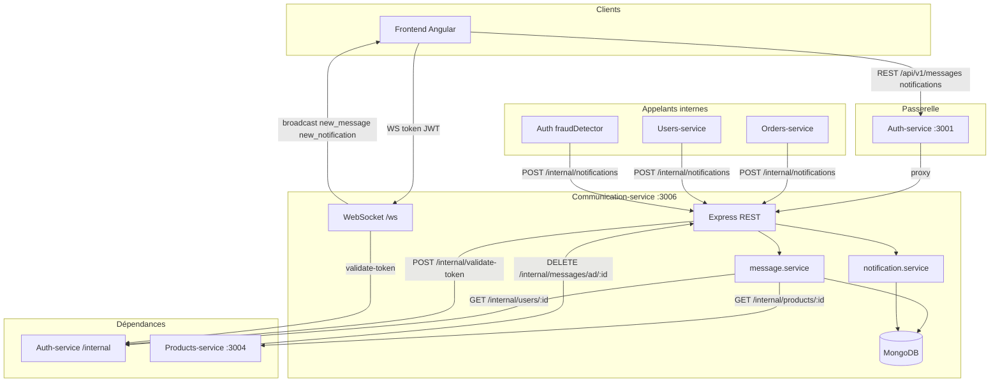

# Communication-service

## Rôle

Service unifié de **communication interne** (fusion juin 2026) :

- **Messagerie** acheteur ↔ vendeur autour d'une annonce
- **Messagerie support** admin / assistance ↔ client
- **Notifications in-app** (anciennement Notifications-service port 3010)
- **WebSocket temps réel** (`new_message`, `new_notification`)

Le REST public passe par **Auth-service** (port 3001) ; le WebSocket se connecte **directement** sur le port 3006.

**Repo Git :** `communication-interne`

---

## Port et santé

| Élément | Valeur |
|---|---|
| Port par défaut | `3006` |
| Healthcheck | `GET /health` |
| WebSocket | `ws://localhost:3006/ws?token=<JWT>` |

---

## Base de données MongoDB

Base : `danebcys` (variable `MONGO_DB_NAME`)

### Collection `messages`

| Champ | Description |
|---|---|
| `ad_id` | ID annonce Products-service, ou `"admin"` pour le support |
| `thread_code` | Clé de fil (`{adId}_{userA}_{userB}` triés, ou `admin_{clientId}`) |
| `sender_id` / `receiver_id` | UUID utilisateurs (Auth-service) |
| `content` | Texte du message |
| `is_read` | Lu par le destinataire |
| `deleted` | Suppression logique |
| `created_at` | Date d'envoi |

### Collection `notifications`

| Champ | Description |
|---|---|
| `user_id` | Destinataire |
| `type` | Ex. `new_message`, `activité_frauduleuse`, `order_shipped` |
| `message` | Texte affiché |
| `is_read` / `deleted` | État |
| `created_at` | Date de création |

Types réservés aux **admins** : `activité_frauduleuse`, `payment_pending`, `subscription_pending`, `student_proof_pending`, `order_shipped`.

---

## Architecture



---

## Routes publiques

Proxifiées par Auth-service sous `/api/v1/…` — JWT Bearer requis.

### Messagerie (`/api/v1/messages`)

| Méthode | Route | Description |
|---|---|---|
| GET | `/inbox` | Boîte de réception (fils agrégés) |
| GET | `/unread/count` | Messages non lus |
| GET | `/thread/:threadCode` | Messages d'un fil |
| GET | `/:adId` | Messages liés à une annonce |
| POST | `/:adId` | Envoyer un message (acheteur initie) |
| POST | `/thread/:threadCode/send` | Répondre dans un fil existant |
| PUT | `/:messageId/read` | Marquer un message comme lu |
| POST | `/admin/start/:userId` | Démarrer conversation support (admin/assistance) |
| POST | `/admin/send/:userId` | Message support vers un client |
| POST | `/admin/broadcast` | Message support à plusieurs utilisateurs |

### Notifications (`/api/v1/notifications`)

| Méthode | Route | Description |
|---|---|---|
| GET | `/` | Liste paginée |
| GET | `/unread/count` | Nombre de non lues |
| PUT | `/read-all` | Tout marquer comme lu |
| PUT | `/:id/read` | Marquer une notification comme lue |

---

## Routes internes (`/internal`)

Protégées par en-tête `X-Service-Key` (= `INTER_SERVICE_KEY`).

| Méthode | Route | Description | Appelants typiques |
|---|---|---|---|
| GET | `/messages/ad/:adId/count` | Nombre de messages d'une annonce | Products-service |
| DELETE | `/messages/ad/:adId` | Suppression logique des messages | Products-service |
| POST | `/notifications` | Créer une notification + push WS | Auth, Orders, Users |

Corps `POST /internal/notifications` : `{ userId, type, message }`.

---

## WebSocket

- URL : `ws://<host>:3006/ws?token=<accessToken>`
- Authentification : validation JWT via Auth-service
- Événements émis :
  - `{ type: "new_message", message: { … } }`
  - `{ type: "new_notification", notification: { … } }`

---

## Variables d'environnement

| Variable | Obligatoire | Défaut | Description |
|---|---|---|---|
| `PORT` | Non | `3006` | Port HTTP + WebSocket |
| `NODE_ENV` | Non | `development` | Environnement |
| `MONGO_URI` | **Oui** | — | URI MongoDB |
| `MONGO_DB_NAME` | **Oui** | `danebcys` | Nom de la base |
| `AUTH_SERVICE_URL` | **Oui** | `http://localhost:3001` | Validation JWT et profils |
| `PRODUCTS_SERVICE_URL` | Non | `http://localhost:3004` | Infos annonce (vendeur, titre) |
| `INTER_SERVICE_KEY` | **Oui** | — | Clé partagée inter-services |
| `RATE_LIMIT_WINDOW_MS` | Non | `900000` | Fenêtre rate limit (15 min) |
| `RATE_LIMIT_MAX_REQUESTS` | Non | `100` | Requêtes max par fenêtre |
| `NOTIFICATIONS_SERVICE_URL` | Non | `http://localhost:3010` | Conservé pour compatibilité (non utilisé depuis fusion) |

---

## Dépendances inter-services

| Service | Port | Usage |
|---|---|---|
| **Auth-service** | 3001 | `POST /internal/validate-token` (REST + WS), `GET /internal/users/:id` (inbox support) |
| **Products-service** | 3004 | `GET /internal/products/:id` (vendeur, titre annonce) |

**Consommateurs** de Communication-service :

- **Auth-service** — alertes fraude admin (`POST /internal/notifications`)
- **Orders-service** — notifications commande
- **Users-service** — notifications abonnement
- **Products-service** — comptage / suppression messages liés à une annonce

---

## Structure du projet

```
Communication-service/
├── server.js                    # Démarrage HTTP + WebSocket
├── src/
│   ├── app.js                   # Express, routes, health
│   ├── config/
│   │   ├── env.js               # Variables d'environnement
│   │   └── mongodb.js           # Connexion + index
│   ├── controllers/
│   │   ├── message.controller.js
│   │   └── notification.controller.js
│   ├── middlewares/
│   │   ├── auth.js              # JWT via Auth-service
│   │   ├── adminAuth.js         # Rôles admin / assistance
│   │   ├── rateLimiter.js       # Limite par utilisateur
│   │   └── serviceAuth.js       # X-Service-Key
│   ├── routes/
│   │   ├── message.routes.js
│   │   ├── notification.routes.js
│   │   └── internal.routes.js
│   ├── services/
│   │   ├── message.service.js
│   │   ├── notification.service.js
│   │   ├── notificationsClient.js  # Mongo + WS (remplace HTTP externe)
│   │   ├── authClient.js
│   │   └── productsClient.js
│   ├── utils/
│   │   └── errors.js
│   └── websocket/
│       └── wsServer.js          # Connexions temps réel
├── public/                      # Page de test
├── tests/
└── package.json
```

---

## Démarrage

```bash
# Local
cd Communication-service
npm install
npm run dev

# Docker (monorepo)
docker compose --env-file .env.docker up communication-service
```

Tests unitaires : `npm test`

---

## Historique fusion (2026-06)

L'ancien **Notifications-service** (port 3010) a été fusionné dans Communication-service. Les notifications sont désormais stockées en MongoDB (`notifications`) et poussées via WebSocket localement — plus d'appel HTTP vers un service externe de notifications.
